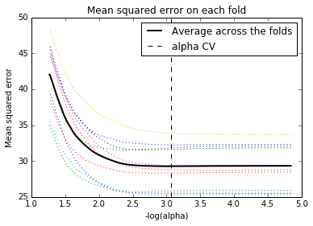

##Lasso Regression Analysis

######Summary:

Using the NESARC data set, we targeted depression as our target. Depression being a major health issue in our modern world we try to find a few causes that closely relate to our target my using the lasso regression method. This reduces the coefficients of our predictors with respect to their connectivity to the target. 


    {'AGE': 0.36782904839027469,
     'ALCEVR1': 0.15365195102379575,
     'ALCPROBS1': 0.28697391793381588,
     'ASIAN': 0.047412176135255481,
     'BLACK': 0.0,
     'CIGAVAIL': 0.064324369645835475,
     'COCEVER1': 0.1351179611310237,
     'DEVIANT1': 0.36670412833232074,
     'ESTEEM1': -1.7652286145736888,
     'EXPEL1': 0.0,
     'FAMCONCT': -0.76871421576887866,
     'GPA1': -0.090492604677189462,
     'HISPANIC': 0.0,
     'INHEVER1': 0.0,
     'MALE': -0.85866012265370595,
     'MAREVER1': 0.0050799568064406097,
     'NAMERICAN': 0.095304431061099246,
     'PARACTV': 0.48203005783859237,
     'PARPRES': -0.060793321061829733,
     'PASSIST': 0.29201801098681479,
     'SCHCONN1': -1.0858658834933537,
     'VIOL1': 0.41709696946651742,
     'WHITE': -0.29107217373767613}


From the output above, we can clearly see that Self Esteem has a large negative impact followed by School Connectedness.
We also see that 4 parameters have been nullified and their coefficients have been reduced to zero.

While plotting the same graph, we also see that the alpha values to the Regression Coefficients and we can clearly see the highest impact variable here.


When checking the Mean Squared Error rates, we can see the testing and training data errors are not negligible but minimal with just a 2% difference. 

    Training Data MSE
    28.8359791082
    Test Data MSE
    30.1731423384
    
But when we take a look at the R-square error it is considerably less with the training date having a 31.3% and the testing data have a 34% error rate.


    Training data R-square
    0.313688817193
    Test data R-square
    0.340459503205
    
####Full Program:

```python
# -*- coding: utf-8 -*-
"""
@author: RJ
"""

#from pandas import Series, DataFrame
import pandas as pd
import numpy as np
import matplotlib.pylab as plt
from sklearn.cross_validation import train_test_split
from sklearn.linear_model import LassoLarsCV
```


```python
#Load the dataset
data = pd.read_csv("/Users/Rohit/Desktop/trees.csv")
```


```python
#upper-case all DataFrame column names
data.columns = map(str.upper, data.columns)

# Data Management
data_clean = data.dropna()
recode1 = {1:1, 2:0}
data_clean['MALE']= data_clean['BIO_SEX'].map(recode1)
```

    //anaconda/lib/python3.5/site-packages/ipykernel/__main__.py:7: SettingWithCopyWarning: 
    A value is trying to be set on a copy of a slice from a DataFrame.
    Try using .loc[row_indexer,col_indexer] = value instead
    
    See the caveats in the documentation: http://pandas.pydata.org/pandas-docs/stable/indexing.html#indexing-view-versus-copy


```python
#select predictor variables and target variable as separate data sets  
predvar= data_clean[['MALE','HISPANIC','WHITE','BLACK','NAMERICAN','ASIAN',
'AGE','ALCEVR1','ALCPROBS1','MAREVER1','COCEVER1','INHEVER1','CIGAVAIL','SCHCONN1',
'ESTEEM1','VIOL1','PASSIST','DEVIANT1','GPA1','EXPEL1','FAMCONCT','PARACTV',
'PARPRES']]
 
# target = data_clean.SCHCONN1
target = data_clean.DEP1
```


```python
# standardize predictors to have mean=0 and sd=1
 # changes all the values from a range of -1 to 1 and keeping it as a float.
predictors=predvar.copy()
from sklearn import preprocessing
predictors['MALE']=preprocessing.scale(predictors['MALE'].astype('float64'))
predictors['HISPANIC']=preprocessing.scale(predictors['HISPANIC'].astype('float64'))
predictors['WHITE']=preprocessing.scale(predictors['WHITE'].astype('float64'))
predictors['NAMERICAN']=preprocessing.scale(predictors['NAMERICAN'].astype('float64'))
predictors['ASIAN']=preprocessing.scale(predictors['ASIAN'].astype('float64'))
predictors['AGE']=preprocessing.scale(predictors['AGE'].astype('float64'))
predictors['ALCEVR1']=preprocessing.scale(predictors['ALCEVR1'].astype('float64'))
predictors['ALCPROBS1']=preprocessing.scale(predictors['ALCPROBS1'].astype('float64'))
predictors['MAREVER1']=preprocessing.scale(predictors['MAREVER1'].astype('float64'))
predictors['COCEVER1']=preprocessing.scale(predictors['COCEVER1'].astype('float64'))
predictors['INHEVER1']=preprocessing.scale(predictors['INHEVER1'].astype('float64'))
predictors['CIGAVAIL']=preprocessing.scale(predictors['CIGAVAIL'].astype('float64'))
predictors['SCHCONN1']=preprocessing.scale(predictors['SCHCONN1'].astype('float64'))
predictors['ESTEEM1']=preprocessing.scale(predictors['ESTEEM1'].astype('float64'))
predictors['VIOL1']=preprocessing.scale(predictors['VIOL1'].astype('float64'))
predictors['PASSIST']=preprocessing.scale(predictors['PASSIST'].astype('float64'))
predictors['DEVIANT1']=preprocessing.scale(predictors['DEVIANT1'].astype('float64'))
predictors['GPA1']=preprocessing.scale(predictors['GPA1'].astype('float64'))
predictors['EXPEL1']=preprocessing.scale(predictors['EXPEL1'].astype('float64'))
predictors['FAMCONCT']=preprocessing.scale(predictors['FAMCONCT'].astype('float64'))
predictors['PARACTV']=preprocessing.scale(predictors['PARACTV'].astype('float64'))
predictors['PARPRES']=preprocessing.scale(predictors['PARPRES'].astype('float64'))
```


```python
# split data into train and test sets
pred_train, pred_test, tar_train, tar_test = train_test_split(predictors, target, 
                                                              test_size=.3, random_state=123)
```


```python
# specify the lasso regression model
model=LassoLarsCV(cv=10, precompute=False).fit(pred_train,tar_train)
```


```python
# print variable names and regression coefficients
dict(zip(predictors.columns, model.coef_))
```


    {'AGE': 0.36782904839027469,
     'ALCEVR1': 0.15365195102379575,
     'ALCPROBS1': 0.28697391793381588,
     'ASIAN': 0.047412176135255481,
     'BLACK': 0.0,
     'CIGAVAIL': 0.064324369645835475,
     'COCEVER1': 0.1351179611310237,
     'DEVIANT1': 0.36670412833232074,
     'ESTEEM1': -1.7652286145736888,
     'EXPEL1': 0.0,
     'FAMCONCT': -0.76871421576887866,
     'GPA1': -0.090492604677189462,
     'HISPANIC': 0.0,
     'INHEVER1': 0.0,
     'MALE': -0.85866012265370595,
     'MAREVER1': 0.0050799568064406097,
     'NAMERICAN': 0.095304431061099246,
     'PARACTV': 0.48203005783859237,
     'PARPRES': -0.060793321061829733,
     'PASSIST': 0.29201801098681479,
     'SCHCONN1': -1.0858658834933537,
     'VIOL1': 0.41709696946651742,
     'WHITE': -0.29107217373767613}


```python
# plot coefficient progression
%matplotlib inline
m_log_alphas = -np.log10(model.alphas_)
ax = plt.gca()
plt.plot(m_log_alphas, model.coef_path_.T)
plt.axvline(-np.log10(model.alpha_), linestyle='--', color='k',
            label='alpha CV')
plt.ylabel('Regression Coefficients')
plt.xlabel('-log(alpha)')
plt.title('Regression Coefficients Progression for Lasso Paths')
```


    <matplotlib.text.Text at 0x11ec81860>


```python
# plot mean square error for each fold
m_log_alphascv = -np.log10(model.cv_alphas_)
plt.figure()
plt.plot(m_log_alphascv, model.cv_mse_path_, ':')
plt.plot(m_log_alphascv, model.cv_mse_path_.mean(axis=-1), 'k',
         label='Average across the folds', linewidth=2)
plt.axvline(-np.log10(model.alpha_), linestyle='--', color='k',
            label='alpha CV')
plt.legend()
plt.xlabel('-log(alpha)')
plt.ylabel('Mean squared error')
plt.title('Mean squared error on each fold')
```


    <matplotlib.text.Text at 0x11a38b5f8>





```python
# MSE from training and test data
from sklearn.metrics import mean_squared_error
train_error = mean_squared_error(tar_train, model.predict(pred_train))
test_error = mean_squared_error(tar_test, model.predict(pred_test))
print ('training data MSE')
print(train_error)
print ('test data MSE')
print(test_error)

# R-square from training and test data
rsquared_train=model.score(pred_train,tar_train)
rsquared_test=model.score(pred_test,tar_test)
print ('training data R-square')
print(rsquared_train)
print ('test data R-square')
print(rsquared_test)
```

    training data MSE
    28.8359791082
    test data MSE
    30.1731423384
    training data R-square
    0.313688817193
    test data R-square
    0.340459503205


```python

```
