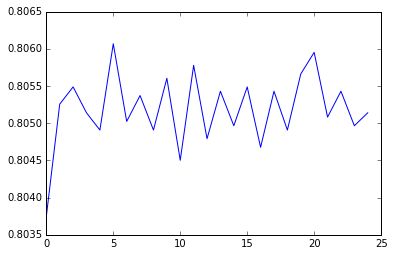

##Random Forest Generation

######Summary:

Using the NESARC data set, we picked drinking as a problem. So using the variable where it checks if the induvidual has ever drank alcohol even once, we assign that as our target, and The parameters include, number of relatives, father or mother's presence in the house, other relatives, non-relatives living in-house and also we've included the sex of the induvidual to see if it plays a part.
Later while taking the importance of each of these features, we notice that the sex plays an important part in whether the induvidual drinks or not, and also, finds that number of people living in the same household, especially non-relatives directly impact whether the induvidual drinks. 
While running our tests one variable at a time added to the test, the accuracy barely changes from 80.5% to 80.55% and thus shows its enough for one variable to determine the outcome of the result.




> Start the program by importing the required packages that include
> a bunch of sklearn packages for our analysis.

```python
from pandas import Series, DataFrame
import pandas as pd
import numpy as np
import os
import matplotlib.pylab as plt
from sklearn.cross_validation import train_test_split
from sklearn.tree import DecisionTreeClassifier
from sklearn.metrics import classification_report
import sklearn.metrics
#For understanding evaluation of feature for the given target
from sklearn import datasets
from sklearn.ensemble import ExtraTreesClassifier
```

> Import the CSV using Pandas dataframe

```python
AH_data = pd.read_csv("/Users/Rohit/Desktop/nesarc_pds.csv")
data_clean = AH_data.dropna()
```

> Displays datatypes of the imported table

```python
data_clean.dtypes
```


>
    ETHRACE2A          int64
    ETOTLCA2          object
    IDNUM              int64
    PSU                int64
    STRATUM            int64
    WEIGHT           float64
    CDAY               int64
    CMON               int64
    CYEAR              int64
    REGION             int64
    CENDIV             int64
    CCS                int64
    FIPSTATE           int64
    BUILDTYP           int64
    NUMPERS            int64
    NUMPER18           int64
    NUMREL             int64
    NUMREL18           int64
    CHLD0              int64
    CHLD1_4            int64
    CHLD5_12           int64
    CHLD13_15          int64
    CHLD16_17          int64
    CHLD0_17           int64
    SPOUSE             int64
    FATHERIH           int64
    MOTHERIH           int64
    ADULTCH            int64
    OTHREL             int64
    NONREL             int64
                      ...   
    DEPPDDX2           int64
    OBCOMDX2           int64
    PARADX2            int64
    SCHIZDX2           int64
    HISTDX2            int64
    ALCABDEP12DX       int64
    ALCABDEPP12DX      int64
    TAB12MDX           int64
    TABP12MDX          int64
    TABLIFEDX          int64
    STIM12ABDEP        int64
    STIMP12ABDEP       int64
    PAN12ABDEP         int64
    PANP12ABDEP        int64
    SED12ABDEP         int64
    SEDP12ABDEP        int64
    TRAN12ABDEP        int64
    TRANP12ABDEP       int64
    COC12ABDEP         int64
    COCP12ABDEP        int64
    SOL12ABDEP         int64
    SOLP12ABDEP        int64
    HAL12ABDEP         int64
    HALP12ABDEP        int64
    MAR12ABDEP         int64
    MARP12ABDEP        int64
    HER12ABDEP         int64
    HERP12ABDEP        int64
    OTHB12ABDEP        int64
    OTHBP12ABDEP       int64
    dtype: object


> Describing the characteristics of the data in the table

```python
data_clean.describe()
```


>
<div>
<table border="1" class="dataframe">
  <thead>
    <tr style="text-align: right;">
      <th></th>
      <th>ETHRACE2A</th>
      <th>IDNUM</th>
      <th>PSU</th>
      <th>STRATUM</th>
      <th>WEIGHT</th>
      <th>CDAY</th>
      <th>CMON</th>
      <th>CYEAR</th>
      <th>REGION</th>
      <th>CENDIV</th>
      <th>...</th>
      <th>SOL12ABDEP</th>
      <th>SOLP12ABDEP</th>
      <th>HAL12ABDEP</th>
      <th>HALP12ABDEP</th>
      <th>MAR12ABDEP</th>
      <th>MARP12ABDEP</th>
      <th>HER12ABDEP</th>
      <th>HERP12ABDEP</th>
      <th>OTHB12ABDEP</th>
      <th>OTHBP12ABDEP</th>
    </tr>
  </thead>
  <tbody>
    <tr>
      <th>count</th>
      <td>43093.000000</td>
      <td>43093.000000</td>
      <td>43093.000000</td>
      <td>43093.000000</td>
      <td>43093.000000</td>
      <td>43093.000000</td>
      <td>43093.000000</td>
      <td>43093.000000</td>
      <td>43093.000000</td>
      <td>43093.000000</td>
      <td>...</td>
      <td>43093.000000</td>
      <td>43093.000000</td>
      <td>43093.000000</td>
      <td>43093.000000</td>
      <td>43093.000000</td>
      <td>43093.000000</td>
      <td>43093.000000</td>
      <td>43093.000000</td>
      <td>43093.000000</td>
      <td>43093.000000</td>
    </tr>
    <tr>
      <th>mean</th>
      <td>2.087764</td>
      <td>21547.000000</td>
      <td>27312.909544</td>
      <td>2726.858747</td>
      <td>4823.981575</td>
      <td>16.146195</td>
      <td>8.589632</td>
      <td>2001.141578</td>
      <td>2.636321</td>
      <td>5.142993</td>
      <td>...</td>
      <td>0.000255</td>
      <td>0.003922</td>
      <td>0.001532</td>
      <td>0.017776</td>
      <td>0.018634</td>
      <td>0.095027</td>
      <td>0.000348</td>
      <td>0.004618</td>
      <td>0.000093</td>
      <td>0.001230</td>
    </tr>
    <tr>
      <th>std</th>
      <td>1.560799</td>
      <td>12440.021912</td>
      <td>16019.733641</td>
      <td>1595.979984</td>
      <td>3485.046966</td>
      <td>8.801055</td>
      <td>3.051984</td>
      <td>0.348620</td>
      <td>1.031667</td>
      <td>2.511825</td>
      <td>...</td>
      <td>0.018655</td>
      <td>0.079789</td>
      <td>0.050501</td>
      <td>0.169523</td>
      <td>0.186201</td>
      <td>0.383204</td>
      <td>0.030082</td>
      <td>0.106426</td>
      <td>0.015233</td>
      <td>0.047429</td>
    </tr>
    <tr>
      <th>min</th>
      <td>1.000000</td>
      <td>1.000000</td>
      <td>1001.000000</td>
      <td>101.000000</td>
      <td>398.037382</td>
      <td>1.000000</td>
      <td>1.000000</td>
      <td>2001.000000</td>
      <td>1.000000</td>
      <td>1.000000</td>
      <td>...</td>
      <td>0.000000</td>
      <td>0.000000</td>
      <td>0.000000</td>
      <td>0.000000</td>
      <td>0.000000</td>
      <td>0.000000</td>
      <td>0.000000</td>
      <td>0.000000</td>
      <td>0.000000</td>
      <td>0.000000</td>
    </tr>
    <tr>
      <th>25%</th>
      <td>1.000000</td>
      <td>10774.000000</td>
      <td>12044.000000</td>
      <td>1209.000000</td>
      <td>2240.897957</td>
      <td>8.000000</td>
      <td>8.000000</td>
      <td>2001.000000</td>
      <td>2.000000</td>
      <td>3.000000</td>
      <td>...</td>
      <td>0.000000</td>
      <td>0.000000</td>
      <td>0.000000</td>
      <td>0.000000</td>
      <td>0.000000</td>
      <td>0.000000</td>
      <td>0.000000</td>
      <td>0.000000</td>
      <td>0.000000</td>
      <td>0.000000</td>
    </tr>
    <tr>
      <th>50%</th>
      <td>1.000000</td>
      <td>21547.000000</td>
      <td>27018.000000</td>
      <td>2701.000000</td>
      <td>3723.955061</td>
      <td>16.000000</td>
      <td>9.000000</td>
      <td>2001.000000</td>
      <td>3.000000</td>
      <td>5.000000</td>
      <td>...</td>
      <td>0.000000</td>
      <td>0.000000</td>
      <td>0.000000</td>
      <td>0.000000</td>
      <td>0.000000</td>
      <td>0.000000</td>
      <td>0.000000</td>
      <td>0.000000</td>
      <td>0.000000</td>
      <td>0.000000</td>
    </tr>
    <tr>
      <th>75%</th>
      <td>2.000000</td>
      <td>32320.000000</td>
      <td>40019.000000</td>
      <td>4004.000000</td>
      <td>7013.033942</td>
      <td>24.000000</td>
      <td>10.000000</td>
      <td>2001.000000</td>
      <td>3.000000</td>
      <td>7.000000</td>
      <td>...</td>
      <td>0.000000</td>
      <td>0.000000</td>
      <td>0.000000</td>
      <td>0.000000</td>
      <td>0.000000</td>
      <td>0.000000</td>
      <td>0.000000</td>
      <td>0.000000</td>
      <td>0.000000</td>
      <td>0.000000</td>
    </tr>
    <tr>
      <th>max</th>
      <td>5.000000</td>
      <td>43093.000000</td>
      <td>56017.000000</td>
      <td>5605.000000</td>
      <td>57902.204790</td>
      <td>31.000000</td>
      <td>12.000000</td>
      <td>2002.000000</td>
      <td>4.000000</td>
      <td>9.000000</td>
      <td>...</td>
      <td>2.000000</td>
      <td>3.000000</td>
      <td>3.000000</td>
      <td>3.000000</td>
      <td>3.000000</td>
      <td>3.000000</td>
      <td>3.000000</td>
      <td>3.000000</td>
      <td>3.000000</td>
      <td>3.000000</td>
    </tr>
  </tbody>
</table>
<p>8 rows × 665 columns</p>
</div>

```
```

> Similar to the decision tree, we select the few parameters that we want to consider for a particular target. In this table, we've
> selected our target to if the person has ever had alcohol before.
> We're going to testing this target with the parameters revolving around people the person grew/lived with. The parameters include, 
> number of relatives, father or mother's presence in the house, other relatives, non-relatives living in-house and also we've included
> the sex of the induvidual to see if it plays a part.

```python
#Split into training and testing sets

predictors = data_clean[['NUMREL','FATHERIH','MOTHERIH','ADULTCH','OTHREL','NONREL','SEX']]

#Target; Alcohol over
targets = data_clean.S2AQ1

pred_train, pred_test, tar_train, tar_test  = train_test_split(predictors, targets, test_size=.4)
```

> We check the shapes of each of our outputs

```python
pred_train.shape
```


>
    (25855, 7)


```python
pred_test.shape
```


>
    (17238, 7)


```python
tar_train.shape
```


>
    (25855,)


```python
tar_test.shape
```


>
    (17238,)

```
```


> Now in a random forest, we have multiple such trees that create a forest, and the number of trees is indicated
> here as n_estimators, and we are initializing it as 25.

```python
from sklearn.ensemble import RandomForestClassifier

classifier=RandomForestClassifier(n_estimators=25)
classifier=classifier.fit(pred_train,tar_train)
predictions=classifier.predict(pred_test)
```
> Displays the confusion matrix

```python
sklearn.metrics.confusion_matrix(tar_test,predictions)
```


> This shows true positives to be 13821, and true negatives are 68.
> Similar the false positives turn out to be 3246 samples and false negatives turn out to be 103.

    array([[13821,   103],
           [ 3246,    68]])


> From the above matrix we can figure out what the accuracy levels are, but using the
> accuracy score, we get a properly calculated idea.

```python
sklearn.metrics.accuracy_score(tar_test, predictions)
```

>
    0.8057199211045365

```
```
> Fitting an extra trees model to the data, we then display each feature's importance.

```python

model = ExtraTreesClassifier()
model.fit(pred_train,tar_train)
print(model.feature_importances_)
```
> From the output we can see each number related to the initial explanatory variables we mentioned earlier.
> It is clear from the output that we can see how each feature induvidually affects the target, and from 
> our output we see that sex plays an important role, after which the number of relatives in house and 
> presence of non-relatives in house also effect drinking in the same order.

    [ 0.25971821  0.03109818  0.06717772  0.03659551  0.04031468  0.12215325
      0.44294244]

> Now we want to check how the successive addition of each explanatory variable affects the final accuracy

```python
trees=range(25)
accuracy=np.zeros(25)
```
> For each variable, an array stores the accuracy of the test

```python
for idx in range(len(trees)):
   classifier=RandomForestClassifier(n_estimators=idx + 1)
   classifier=classifier.fit(pred_train,tar_train)
   predictions=classifier.predict(pred_test)
   accuracy[idx]=sklearn.metrics.accuracy_score(tar_test, predictions)
```
> And then we plot the output on a line graph

```python
%matplotlib inline
plt.plot(trees, accuracy)
```


    [<matplotlib.lines.Line2D at 0x164305908>]


> From the graph above, it is clear that the first test wouldn't have been enough given that the accuracy of the test
> at first is ~80.5% and the addition of the remaining variables only increase it to around ~80.55% which isn't a huge difference.
