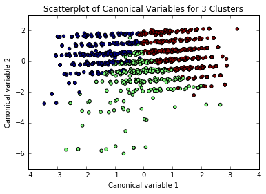

##K-Cluster Analysis

######Summary:
Using the OLL dataset by the Inter-university Consortium for Political and Social Research (ICPSR), we targeted political behavoir as an explantory variable. K-Cluster helps us group these people into different clusters based on their outcome, we used the following variables for this analysis: 
```python 
#W1_A2: How much have you thought about the upcoming election for president?
#W1_A10: How often, if ever, do you discuss politics with your family or friends?
#W1_A11: How many days in the past week did you watch national news programs on television or on the Internet?
#W1_A12: Do you approve or disapprove of the way Barack Obama is handling his job as President?
#W1_B2: How much can people like you affect what the government does?
```

<div>
<table border="1" class="dataframe">
  <thead>
    <tr style="text-align: right;">
      <th></th>
      <th>W1_A2</th>
      <th>W1_A10</th>
      <th>W1_A11</th>
      <th>W1_A12</th>
      <th>W1_B1</th>
    </tr>
  </thead>
  <tbody>
    <tr>
      <th>count</th>
      <td>2292.000000</td>
      <td>2292.000000</td>
      <td>2292.000000</td>
      <td>2292.000000</td>
      <td>2292.000000</td>
    </tr>
    <tr>
      <th>mean</th>
      <td>2.130017</td>
      <td>2.678010</td>
      <td>4.192845</td>
      <td>1.239965</td>
      <td>3.599913</td>
    </tr>
    <tr>
      <th>std</th>
      <td>1.210902</td>
      <td>1.227214</td>
      <td>2.624862</td>
      <td>0.578239</td>
      <td>1.143200</td>
    </tr>
    <tr>
      <th>min</th>
      <td>-1.000000</td>
      <td>-1.000000</td>
      <td>-1.000000</td>
      <td>-1.000000</td>
      <td>-1.000000</td>
    </tr>
    <tr>
      <th>25%</th>
      <td>1.000000</td>
      <td>2.000000</td>
      <td>2.000000</td>
      <td>1.000000</td>
      <td>3.000000</td>
    </tr>
    <tr>
      <th>50%</th>
      <td>2.000000</td>
      <td>2.000000</td>
      <td>4.000000</td>
      <td>1.000000</td>
      <td>4.000000</td>
    </tr>
    <tr>
      <th>75%</th>
      <td>3.000000</td>
      <td>4.000000</td>
      <td>7.000000</td>
      <td>2.000000</td>
      <td>4.000000</td>
    </tr>
    <tr>
      <th>max</th>
      <td>5.000000</td>
      <td>5.000000</td>
      <td>8.000000</td>
      <td>2.000000</td>
      <td>5.000000</td>
    </tr>
  </tbody>
</table>
</div>

Having all these variables, we wanted to know the best number of clusters by using the Elbow Method, and the graph output shown below indicated that the best change where the variance doesn't change as much lies on 3 clusters.


And running the clusters for 3 clusters, we get an output that shows a lot of overlap, and the green cluster shows too much variance shown below.



So to verify we check the means of the values for each variable in each cluster separately, as shown below. It is clear that people who are aware of the upcoming election for president don't discuss politics with family or friends at all, and that represents Cluster 0. But people who have watched recent new programs the most in Cluster 2 are the ones who share their stories with family and friends. 

While trying to analyse whether the people are happy with the way Obama is handling his job as president, we can see the most oblivious and the most interested people in politics agree (Cluster 0 and 2) whereas Cluster 1 think otherwise.

    Clustering variable means by cluster
                   index     W1_A2    W1_A10    W1_A11    W1_A12     W1_B1
    cluster                                                               
    0        1224.693446  1.151703 -0.819682 -0.804982  0.250493  0.547970
    1        1142.483431 -0.195955 -0.301577 -0.339406 -0.560074 -0.707371
    2        1095.655340 -0.710197  0.830843  0.847091  0.209088  0.132024

While verifying with W1_A1: How interested are you in what's going on in government and politics?, it turns out that the most interested in politics correlate with the Cluster 0 and this group turns out to be intrested with the current election and seem more serious about it.


    means for W1_A1 by cluster
                W1_A1
    cluster          
    0        3.742072
    1        2.672515
    2        1.864078
    
    
####[Full Program] (https://github.com/RohitJacob/Machine-Learning-for-Data-Analysis/blob/master/PeopleAnalyticsOnPolitics/PeopleAnalyticsOnPolitics.ipynb)
