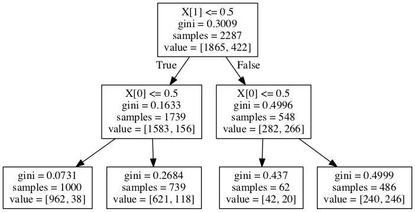

```python
# -*- coding: utf-8 -*-
"""
Created on Sun June 19 21:12:54 2016

@author: Rohit
"""

# -*- coding: utf-8 -*-
```


    '\nCreated on Sun June 19 21:12:54 2016\n\n@author: Rohit\n'


```python
from pandas import Series, DataFrame
import pandas as pd
import numpy as np
import os
import matplotlib.pylab as plt
from sklearn.cross_validation import train_test_split
from sklearn.tree import DecisionTreeClassifier
from sklearn.metrics import classification_report
import sklearn.metrics
from sklearn import tree
#from StringIO import StringIO
from io import StringIO
#from StringIO import StringIO 
from IPython.display import Image
out = StringIO()
tree.export_graphviz(classifier, out_file=out)
import pydotplus
```


```python
gathered_data = pd.read_csv("/Users/Rohit/Desktop/trees.csv")

data_clean = gathered_data.dropna()
```


```python
data_clean.dtypes
```


    BIO_SEX      float64
    HISPANIC     float64
    WHITE        float64
    BLACK        float64
    NAMERICAN    float64
    ASIAN        float64
    age          float64
    TREG1        float64
    ALCEVR1      float64
    ALCPROBS1      int64
    marever1       int64
    cocever1       int64
    inhever1       int64
    cigavail     float64
    DEP1         float64
    ESTEEM1      float64
    VIOL1        float64
    PASSIST        int64
    DEVIANT1     float64
    SCHCONN1     float64
    GPA1         float64
    EXPEL1       float64
    FAMCONCT     float64
    PARACTV      float64
    PARPRES      float64
    dtype: object


```python
data_clean.describe()
```


<div>
<table border="1" class="dataframe">
  <thead>
    <tr style="text-align: right;">
      <th></th>
      <th>BIO_SEX</th>
      <th>HISPANIC</th>
      <th>WHITE</th>
      <th>BLACK</th>
      <th>NAMERICAN</th>
      <th>ASIAN</th>
      <th>age</th>
      <th>TREG1</th>
      <th>ALCEVR1</th>
      <th>ALCPROBS1</th>
      <th>...</th>
      <th>ESTEEM1</th>
      <th>VIOL1</th>
      <th>PASSIST</th>
      <th>DEVIANT1</th>
      <th>SCHCONN1</th>
      <th>GPA1</th>
      <th>EXPEL1</th>
      <th>FAMCONCT</th>
      <th>PARACTV</th>
      <th>PARPRES</th>
    </tr>
  </thead>
  <tbody>
    <tr>
      <th>count</th>
      <td>4575.000000</td>
      <td>4575.000000</td>
      <td>4575.000000</td>
      <td>4575.000000</td>
      <td>4575.000000</td>
      <td>4575.000000</td>
      <td>4575.000000</td>
      <td>4575.000000</td>
      <td>4575.000000</td>
      <td>4575.000000</td>
      <td>...</td>
      <td>4575.000000</td>
      <td>4575.000000</td>
      <td>4575.000000</td>
      <td>4575.000000</td>
      <td>4575.000000</td>
      <td>4575.000000</td>
      <td>4575.000000</td>
      <td>4575.000000</td>
      <td>4575.000000</td>
      <td>4575.000000</td>
    </tr>
    <tr>
      <th>mean</th>
      <td>1.521093</td>
      <td>0.111038</td>
      <td>0.683279</td>
      <td>0.236066</td>
      <td>0.036284</td>
      <td>0.040437</td>
      <td>16.493052</td>
      <td>0.176393</td>
      <td>0.527432</td>
      <td>0.369180</td>
      <td>...</td>
      <td>40.952131</td>
      <td>1.618579</td>
      <td>0.102514</td>
      <td>2.645027</td>
      <td>28.360656</td>
      <td>2.815647</td>
      <td>0.040219</td>
      <td>22.570557</td>
      <td>6.290710</td>
      <td>13.398033</td>
    </tr>
    <tr>
      <th>std</th>
      <td>0.499609</td>
      <td>0.314214</td>
      <td>0.465249</td>
      <td>0.424709</td>
      <td>0.187017</td>
      <td>0.197004</td>
      <td>1.552174</td>
      <td>0.381196</td>
      <td>0.499302</td>
      <td>0.894947</td>
      <td>...</td>
      <td>5.381439</td>
      <td>2.593230</td>
      <td>0.303356</td>
      <td>3.520554</td>
      <td>5.156385</td>
      <td>0.770167</td>
      <td>0.196493</td>
      <td>2.614754</td>
      <td>3.360219</td>
      <td>2.085837</td>
    </tr>
    <tr>
      <th>min</th>
      <td>1.000000</td>
      <td>0.000000</td>
      <td>0.000000</td>
      <td>0.000000</td>
      <td>0.000000</td>
      <td>0.000000</td>
      <td>12.676712</td>
      <td>0.000000</td>
      <td>0.000000</td>
      <td>0.000000</td>
      <td>...</td>
      <td>18.000000</td>
      <td>0.000000</td>
      <td>0.000000</td>
      <td>0.000000</td>
      <td>6.000000</td>
      <td>1.000000</td>
      <td>0.000000</td>
      <td>6.300000</td>
      <td>0.000000</td>
      <td>3.000000</td>
    </tr>
    <tr>
      <th>25%</th>
      <td>1.000000</td>
      <td>0.000000</td>
      <td>0.000000</td>
      <td>0.000000</td>
      <td>0.000000</td>
      <td>0.000000</td>
      <td>15.254795</td>
      <td>0.000000</td>
      <td>0.000000</td>
      <td>0.000000</td>
      <td>...</td>
      <td>38.000000</td>
      <td>0.000000</td>
      <td>0.000000</td>
      <td>0.000000</td>
      <td>25.000000</td>
      <td>2.250000</td>
      <td>0.000000</td>
      <td>21.700000</td>
      <td>4.000000</td>
      <td>12.000000</td>
    </tr>
    <tr>
      <th>50%</th>
      <td>2.000000</td>
      <td>0.000000</td>
      <td>1.000000</td>
      <td>0.000000</td>
      <td>0.000000</td>
      <td>0.000000</td>
      <td>16.509589</td>
      <td>0.000000</td>
      <td>1.000000</td>
      <td>0.000000</td>
      <td>...</td>
      <td>40.000000</td>
      <td>0.000000</td>
      <td>0.000000</td>
      <td>1.000000</td>
      <td>29.000000</td>
      <td>2.750000</td>
      <td>0.000000</td>
      <td>23.700000</td>
      <td>6.000000</td>
      <td>14.000000</td>
    </tr>
    <tr>
      <th>75%</th>
      <td>2.000000</td>
      <td>0.000000</td>
      <td>1.000000</td>
      <td>0.000000</td>
      <td>0.000000</td>
      <td>0.000000</td>
      <td>17.679452</td>
      <td>0.000000</td>
      <td>1.000000</td>
      <td>0.000000</td>
      <td>...</td>
      <td>45.000000</td>
      <td>2.000000</td>
      <td>0.000000</td>
      <td>4.000000</td>
      <td>32.000000</td>
      <td>3.500000</td>
      <td>0.000000</td>
      <td>24.300000</td>
      <td>9.000000</td>
      <td>15.000000</td>
    </tr>
    <tr>
      <th>max</th>
      <td>2.000000</td>
      <td>1.000000</td>
      <td>1.000000</td>
      <td>1.000000</td>
      <td>1.000000</td>
      <td>1.000000</td>
      <td>21.512329</td>
      <td>1.000000</td>
      <td>1.000000</td>
      <td>6.000000</td>
      <td>...</td>
      <td>50.000000</td>
      <td>19.000000</td>
      <td>1.000000</td>
      <td>27.000000</td>
      <td>38.000000</td>
      <td>4.000000</td>
      <td>1.000000</td>
      <td>25.000000</td>
      <td>18.000000</td>
      <td>15.000000</td>
    </tr>
  </tbody>
</table>
<p>8 rows × 25 columns</p>
</div>


```python
predictors = data_clean[['ALCEVR1','marever1']]

targets = data_clean.TREG1

pred_train, pred_test, tar_train, tar_test = train_test_split(predictors, targets, test_size=.5)
```


```python
pred_train.shape
```


    (2287, 2)


```python
pred_test.shape
```


    (2288, 2)


```python
tar_train.shape
```


    (2287,)


```python
tar_test.shape
```


    (2288,)


```python
classifier=DecisionTreeClassifier()
classifier=classifier.fit(pred_train,tar_train)
```


```python
predictions=classifier.predict(pred_test)
```


```python
sklearn.metrics.confusion_matrix(tar_test,predictions)
```


    array([[1618,  263],
           [ 162,  245]])


```python
sklearn.metrics.accuracy_score(tar_test, predictions)
```


    0.81424825174825177


```python
graph=pydotplus.graph_from_dot_data(out.getvalue())
Image(graph.create_png())
```





```python

```


```python

```
